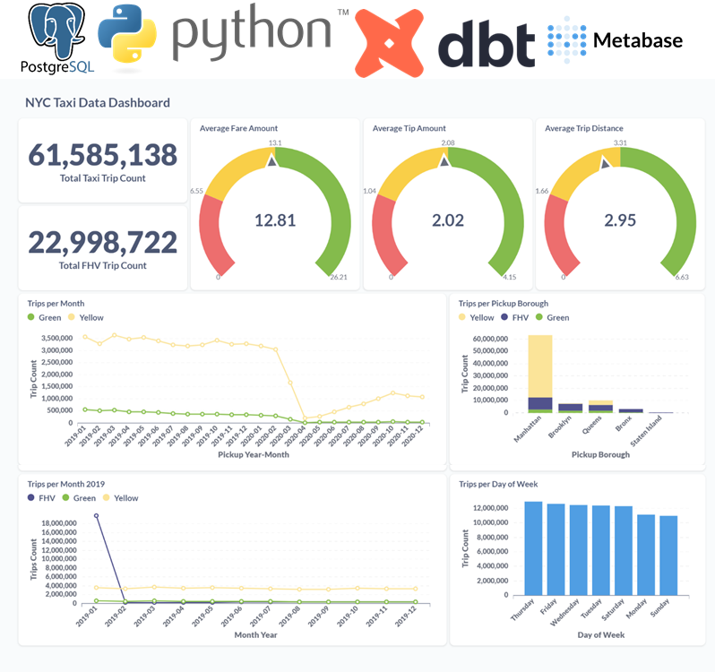
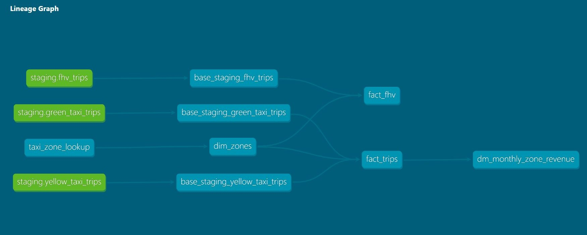

# NYC Taxi Trips Data Project

This project, developed as part of the Data Engineering Zoomcamp, aims to ingest, transform, and visualize New York City (NYC) taxi trip data from CSV files into a PostgreSQL database. The project utilizes a combination of Python scripts, shell scripts, DBT (Data Build Tool), and Metabase to achieve its objectives.

## Objective
The primary goal of this project is to process NYC taxi trip data spanning the years 2019 and 2020, including both Yellow and Green taxi data, as well as For-Hire Vehicle (FHV) data for the year 2019. The process involves ingesting the raw data from CSV files hosted on a public GitHub repository, transforming it using DBT, and finally visualizing the insights using Metabase.

## Components
### 1. Data Ingestion
Python and shell scripts are employed to ingest the CSV files containing NYC taxi trip data from the specified GitHub repository. The data includes Yellow and Green taxi records for 2019 and 2020, as well as FHV data for 2019.

### 2. Data Transformation
DBT is utilized for data transformation tasks. This involves creating tables such as `fact_trips` and `fact_fhv` from the ingested data in the PostgreSQL database. Additionally, various other transformations and tables are created as required for downstream analysis.

### 3. Visualization
Metabase is utilized for visualizing the transformed data. The dashboard created using Metabase provides intuitive visualizations and insights into the NYC taxi trip data, allowing for easier interpretation and analysis.

## Project Structure
- `./scripts`: Contains Python and shell scripts for data ingestion.
- `./dez_nyc_taxi_data_dbt`: Holds DBT Project and SQL transformations.
- `./img`: Contains images, including the DBT lineage graph and Metabase dashboard.
- `README.md`: Documentation providing an overview of the project, setup instructions, and usage guidelines.

## How to Use
1. Clone the repository to your local machine.
2. Run the provided scripts for data ingestion.
3. Configure DBT and execute the transformations.
4. Install and configure Metabase for data visualization.
5. Open the Metabase dashboard image (`./img/Dashboard.png`) to explore insights from the transformed data.

## Metabase Dashboard

## DBT Lineage Graph

## Conclusion
This project demonstrates the end-to-end process of ingesting, transforming, and visualizing NYC taxi trip data using various tools and technologies. By leveraging Python, shell scripts, DBT, and Metabase, meaningful insights can be derived from raw data, facilitating informed decision-making and analysis in the domain of data engineering and analytics.

**Note:** This project is part of the Data Engineering Zoomcamp.
